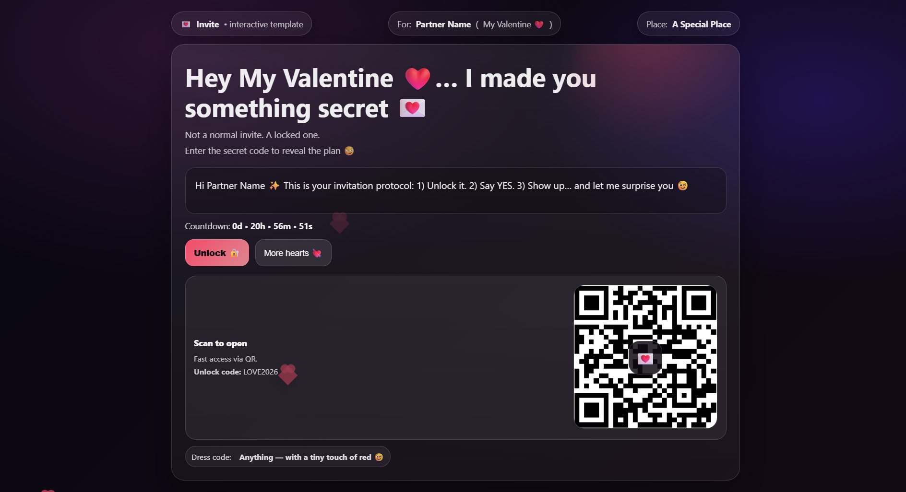
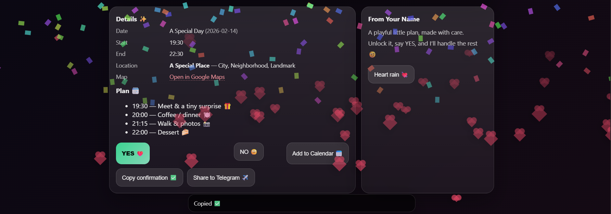

# Interactive Invite Template 💌

A single-file, customizable, interactive invitation page with:
- 🔐 “Unlock” modal (secret code)
- 💘 Floating hearts + confetti
- 📅 Downloadable calendar invite (.ics)
- 📍 Google Maps link
- 📱 Optional QR block + Telegram share button

## Live Demo
https://hossein70s.github.io/interactive-invite-template/

## How to use

1) Copy the example config:
- Duplicate `config.example.json` → rename it to `config.json`

2) Edit `config.json` with your own details:
- names, date/time, location, secret code, plan, etc.

3) Run locally
Open `index.html` with a local server (recommended):
- VS Code: install **Live Server** → right click `index.html` → **Open with Live Server**

## Deploy
You can deploy using **GitHub Pages**:
- Settings → Pages → Deploy from branch → `main` → `/ (root)` → Save

## Notes
- `config.json` is personal. Keep it out of git if you want (add it to `.gitignore`).
- `public_url_for_qr` should be the final deployed URL so the QR points to the correct site.
